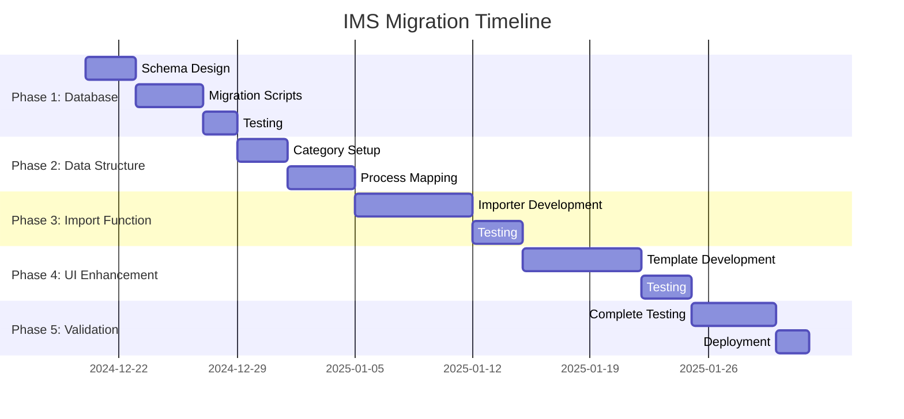

# IMS Documents Register Migration Plan

## Executive Summary

This document outlines the comprehensive migration plan to enhance the existing Process Management System to fully support the IMS (Integrated Management System) Documents Register structure. The migration will expand document categorization, add new departments, and implement ISO-compliant document control features.

## Current Status: 🟡 Planning Phase

**Created:** December 2024  
**Last Updated:** December 2024  
**Status:** In Progress  
**Priority:** High  

---

## 1. Analysis of Current vs. IMS Structure

### 1.1 Current System Capabilities ✅
- **Departments:** 11 predefined departments
- **Document Types:** 3 types (process_map, procedure, risk_register)
- **Features:** Version control, file system handling, migration infrastructure
- **Architecture:** Django-based relational structure

### 1.2 IMS Register Requirements 📋
- **Categories:** 3 main categories (Management, Transport, Districts)
- **Sub-processes:** 40+ specific business processes
- **Document Types:** 7 document types per process
- **Naming Convention:** Standardized ZETDC-HRE format
- **Compliance:** ISO 9001/14001/45001 alignment

### 1.3 Gap Analysis 🔍

| Component | Current | IMS Required | Gap Status |
|-----------|---------|--------------|------------|
| Departments | 11 generic | 3 specific + sub-categories | ❌ Missing |
| Document Types | 3 types | 7 types | ❌ Insufficient |
| Process Granularity | High-level | Process-specific | ❌ Limited |
| Document Codes | Optional | Mandatory standardized | ❌ Missing |
| Compliance Fields | Basic | ISO-compliant | ❌ Limited |

---

## 2. Migration Strategy

### Phase 1: Database Schema Enhancement 🗄️
**Status:** ✅ Completed  
**Duration:** 1-2 weeks  
**Dependencies:** None  

#### 2.1 Enhanced Models Design ✅

```python
# Enhanced ProcessDepartment Model (IMS Departments)
class ProcessDepartment(models.Model):
    name = models.CharField(max_length=100, unique=True)  # MANAGEMENT, TRANSPORT, DISTRICTS
    description = models.TextField()
    order = models.IntegerField()
    # ... existing fields

# Enhanced Process Model
class Process(models.Model):
    # Existing fields...
    department = models.ForeignKey(ProcessDepartment, on_delete=models.CASCADE)
    process_code = models.CharField(max_length=50, unique=True, blank=True)
    ims_reference = models.CharField(max_length=100, blank=True)  # ✅ Added
    iso_clause = models.CharField(max_length=50, blank=True)  # ✅ Added
    
# Extended Document Types ✅
DOCUMENT_TYPES = [
    ('process_map', 'Process Map'),
    ('procedure', 'Associated Procedure'),
    ('risk_register', 'Risk and Opportunity Register'),
    ('objectives_targets', 'Objectives and Targets'),  # ✅ Added
    ('internal_external_issues', 'Internal and External Issues'),  # ✅ Added
    ('stakeholder_needs', 'Stakeholders and Their Needs'),  # ✅ Added
    ('legal_register', 'Legal Register'),  # ✅ Added
]

# Enhanced Document Model ✅
class ProcessDocument(models.Model):
    # Existing fields...
    document_code = models.CharField(max_length=100, unique=True, blank=True)  # ✅ Added
    ims_file_reference = models.CharField(max_length=200, blank=True)  # ✅ Added
    compliance_status = models.CharField(max_length=20, default='draft')  # ✅ Added
    review_due_date = models.DateField(null=True, blank=True)  # ✅ Added
    approval_authority = models.ForeignKey(UserProfile, on_delete=models.SET_NULL, null=True)  # ✅ Added
```

#### 2.2 Database Migration Scripts ✅

**Files Created:**
- `migrations/0002_processcategory_alter_process_options_and_more.py` ✅
- `migrations/0003_populate_ims_categories.py` ✅ (Updated to populate departments)
- `migrations/0004_add_document_code_unique_constraint.py` ✅
- `migrations/0005_add_missing_ims_fields.py` ✅
- `migrations/0006_add_ims_departments.py` ✅

### Phase 2: IMS Data Structure Implementation 📊
**Status:** ✅ Completed  
**Duration:** 1 day  
**Dependencies:** Phase 1  

#### 2.1 Process Categories Setup
https://businessexcellence.zetdc.co.zw/comperative_schedule/create_comperative_schedule/
| Category | Sub-Processes | Count | Status |
|----------|---------------|-------|--------|
| **MANAGEMENT PROCESSES** | Internal Auditing, Change Management, etc. | 10 | 🔴 Pending |
| **TRANSPORT** | Vehicle Licensing, Repairs, Maintenance, etc. | 9 | 🔴 Pending |
| **DISTRICTS** | Electrical Faults, Connections, Billing, etc. | 21 | 🔴 Pending |

#### 2.2 Detailed Process Mapping

##### MANAGEMENT PROCESSES
1. ✅ Internal Auditing (ZETDC-HRE MANAGEMENT 01-001)
2. ✅ Change Management (ZETDC-HRE MANAGEMENT 01-002)
3. ✅ Management Review (ZETDC-HRE MANAGEMENT 01-003)
4. ✅ Document Control (External) (01-004)
5. ✅ Document Control (Internal) (01-005)
6. ✅ Legal and Other Requirements (01-006)
7. ✅ Operational Planning (01-007)
8. ✅ Communication (01-008)
9. ✅ Accident Investigation (01-001)
10. ✅ Accident Investigation Review (01-002)

##### TRANSPORT
1. ✅ Vehicle Licensing (ZETDC-HRE TRANS 01-001)
2. ✅ Repairs Outsourcing (01-002)
3. ✅ Registration of New Vehicles (01-003)
4. ✅ Road Traffic Accidents (01-004)
5. ✅ Vehicle Hire (01-005)
6. ✅ Vehicle Tracking (01-006)
7. ✅ Vehicle Maintenance (01-007)
8. ✅ Vehicle Inspection (01-008)
9. ✅ Crane Requests (01-009)

##### DISTRICTS
1. ✅ Electrical Faults (ZETDC-HRE DIS 01-001)
2. ✅ New Connections (Standard) (01-002)
3. ✅ Line Maintenance (01-003)
4. ✅ Theft Management (01-004)
5. ✅ Faulty Transformer Replacement (01-005)
6. ✅ New Connection (Non-Standard) (01-006)
7. ✅ Faulty Meter Replacement (01-007)
8. ✅ Network Re-enforcement Project (01-008)
9. ✅ Network Disconnection (01-009)
10. ✅ Relocation Project (01-010)
11. ✅ Disconnection and Reconnection (01-011)
12. ✅ Energy Loss Banking (01-012)
13. ✅ Meter Reading (01-013)
14. ✅ Receipt/Batch Cancellation (01-014)
15. ✅ Receiving Bill Exceptions (01-015)
16. ✅ Receiving in SAP (01-016)
17. ✅ Receipt Templates (01-017)
18. ✅ Customer Complaints Handling (01-018)
19. ✅ Customer Supplied Materials (01-019)
20. ✅ Clear Tamper Requests (01-020)
21. ✅ Calculation and Posting of Lost Revenue (01-021)

### Phase 3: IMS Import Functionality 📥
**Status:** 🔴 Not Started  
**Duration:** 1-2 weeks  
**Dependencies:** Phase 1, 2  

#### 3.1 Excel Import Module

```python
# New file: process_management/ims_importer.py
class IMSDocumentImporter:
    def __init__(self):
        self.import_log = []
        self.error_log = []
    
    def import_from_excel(self, file_path):
        """Import IMS register from Excel file"""
        pass
    
    def parse_ims_structure(self, worksheet):
        """Parse IMS worksheet structure"""
        pass
    
    def create_process_from_ims(self, row_data):
        """Create process from IMS row data"""
        pass
    
    def map_document_references(self, process, row_data):
        """Map document file references to process"""
        pass
```

#### 3.2 Import Features Checklist

- [ ] **Excel File Parsing** - Read .xlsx files
- [ ] **Structure Validation** - Validate IMS format
- [ ] **Process Creation** - Auto-create processes from register
- [ ] **Document Mapping** - Map document references
- [ ] **Code Generation** - Generate proper ZETDC codes
- [ ] **Error Handling** - Comprehensive error logging
- [ ] **Progress Tracking** - Import progress reporting
- [ ] **Rollback Support** - Transaction safety

### Phase 4: UI/UX Enhancements 🎨
**Status:** 🔴 Not Started  
**Duration:** 1-2 weeks  
**Dependencies:** Phase 1, 2, 3  

#### 4.1 Enhanced Views

**New Templates to Create:**
- `process_categories_list.html`
- `ims_process_detail.html`
- `ims_document_grid.html`
- `import_ims_register.html`

#### 4.2 Enhanced Navigation

```python
# Updated URL patterns
urlpatterns = [
    path('categories/', views.process_categories_view, name='process_categories'),
    path('category/<int:category_id>/', views.category_processes_view, name='category_processes'),
    path('process/<int:process_id>/ims-view/', views.ims_process_detail, name='ims_process_detail'),
    path('import/ims-register/', views.import_ims_register, name='import_ims_register'),
    path('reports/compliance/', views.compliance_report, name='compliance_report'),
]
```

#### 4.3 Dashboard Enhancements

- [ ] **Category Overview** - Process counts by category
- [ ] **Compliance Status** - Document completeness tracking
- [ ] **IMS Grid View** - 7-column document view
- [ ] **Import Progress** - Real-time import status
- [ ] **Search Enhancement** - Search by IMS codes

### Phase 5: Testing & Validation 🧪
**Status:** 🔴 Not Started  
**Duration:** 1 week  
**Dependencies:** All previous phases  

#### 5.1 Test Categories

- [ ] **Unit Tests** - Model and service tests
- [ ] **Integration Tests** - End-to-end workflow
- [ ] **Import Tests** - IMS Excel import validation
- [ ] **UI Tests** - Frontend functionality
- [ ] **Performance Tests** - Large dataset handling
- [ ] **Compliance Tests** - ISO standard alignment

#### 5.2 Validation Checklist

- [ ] All 40+ processes imported correctly
- [ ] Document types properly categorized
- [ ] IMS codes generated accurately
- [ ] Search functionality working
- [ ] Export functionality maintained
- [ ] Migration backward compatibility

---

## 3. Implementation Checklist

### 3.1 Database Changes ✅❌
- [x] Create ProcessCategory model (Updated: Use ProcessDepartment instead)
- [x] Enhance Process model with IMS fields
- [x] Extend document types to 7 categories
- [x] Add compliance and tracking fields
- [x] Create migration scripts
- [x] Test migrations on development

### 3.2 Backend Development ✅❌
- [ ] Implement IMSDocumentImporter class
- [ ] Create category management services
- [ ] Enhance existing migration infrastructure
- [ ] Add IMS-specific validation logic
- [ ] Create compliance reporting services
- [ ] Update API endpoints for new structure

### 3.3 Frontend Development ✅❌
- [ ] Create category navigation interface
- [ ] Design IMS process detail view
- [ ] Implement 7-column document grid
- [ ] Create IMS import interface
- [ ] Enhance search with IMS codes
- [ ] Update dashboard with category metrics

### 3.4 Data Migration ✅❌
- [ ] Backup existing data
- [ ] Run schema migrations
- [ ] Import IMS process structure
- [ ] Validate imported data
- [ ] Update existing processes to new structure
- [ ] Test data integrity

### 3.5 Documentation ✅❌
- [ ] Update user guide for IMS features
- [ ] Create admin documentation
- [ ] Document IMS import process
- [ ] Update API documentation
- [ ] Create compliance guides
- [ ] Update deployment checklist

---

## 4. Risk Assessment & Mitigation

### 4.1 Technical Risks

| Risk | Impact | Probability | Mitigation |
|------|---------|-------------|------------|
| Data Loss during Migration | High | Low | Full backup + rollback plan |
| Performance Degradation | Medium | Medium | Optimize queries + caching |
| Import Errors | Medium | Medium | Comprehensive validation |
| UI/UX Disruption | Low | Low | Gradual rollout |

### 4.2 Business Risks

| Risk | Impact | Probability | Mitigation |
|------|---------|-------------|------------|
| User Adoption Resistance | Medium | Medium | Training + documentation |
| Process Disruption | High | Low | Phased implementation |
| Compliance Gaps | High | Low | ISO standard alignment |

---

## 5. Timeline & Milestones



**Key Milestones:**
- 🎯 **Phase 1 Complete:** December 29, 2024
- 🎯 **Phase 2 Complete:** January 5, 2025
- 🎯 **Phase 3 Complete:** January 15, 2025
- 🎯 **Phase 4 Complete:** January 25, 2025
- 🎯 **Final Deployment:** February 1, 2025

---

## 6. Success Metrics

### 6.1 Technical Metrics
- [ ] **100%** of IMS processes imported successfully
- [ ] **< 2 seconds** average page load time
- [ ] **Zero** data loss during migration
- [ ] **100%** test coverage for new features

### 6.2 Business Metrics
- [ ] **95%** user adoption rate within 30 days
- [ ] **80%** reduction in document lookup time
- [ ] **100%** compliance with ISO standards
- [ ] **50%** improvement in process management efficiency

---

## 7. Support & Maintenance

### 7.1 Post-Migration Support
- [ ] 30-day intensive support period
- [ ] User training sessions
- [ ] Documentation workshops
- [ ] Feedback collection and iterations

### 7.2 Ongoing Maintenance
- [ ] Quarterly IMS register updates
- [ ] Annual compliance reviews
- [ ] Performance monitoring
- [ ] User feedback integration

---

## Progress Tracking

**Overall Progress:** 40% Complete

### Phase Status
- **Phase 1 (Database):** ✅ 100% - Completed
- **Phase 2 (Data Structure):** ✅ 100% - Completed  
- **Phase 3 (Import Function):** 🔴 0% - Not Started
- **Phase 4 (UI Enhancement):** 🔴 0% - Not Started
- **Phase 5 (Testing):** 🔴 0% - Not Started

### Recent Updates
- **Dec 2024:** Initial analysis and planning completed
- **Dec 2024:** Migration plan document created
- **Dec 2024:** Phase 1 database schema design completed
- **Dec 2024:** Phase 2 IMS data structure implementation completed
- **Next:** Begin Phase 3 IMS import functionality

---

## Contact & Approval

**Document Owner:** Development Team  
**Stakeholders:** Process Management Team, IT Department, Compliance Team  
**Approval Required:** Yes  
**Next Review Date:** Weekly during implementation  

---

*This document will be updated regularly throughout the migration process to reflect current status and any changes to the plan.*
